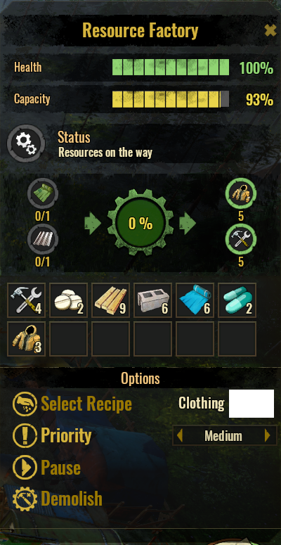
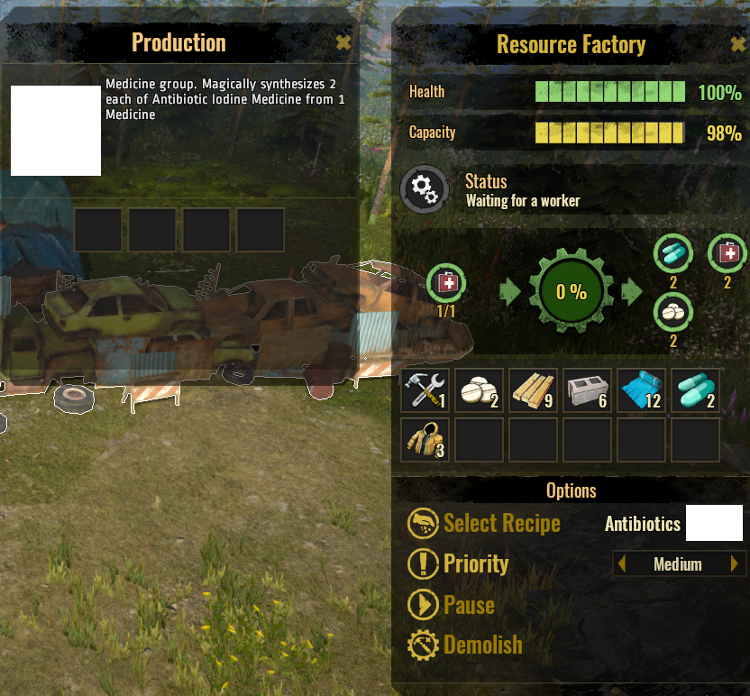
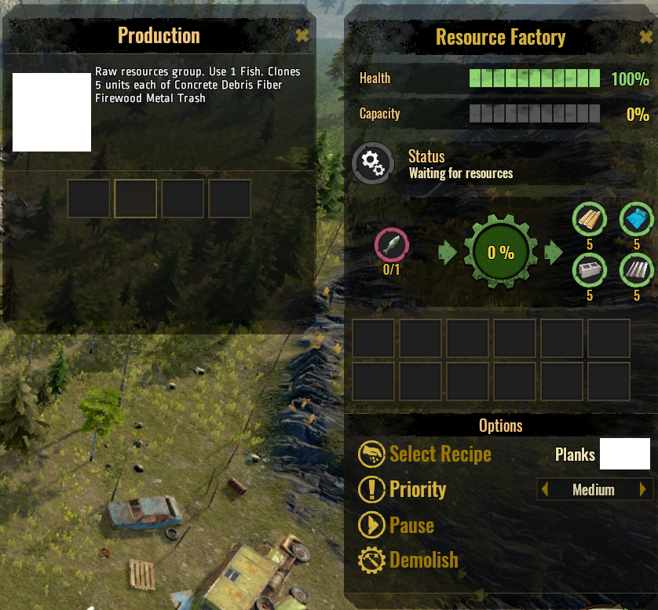
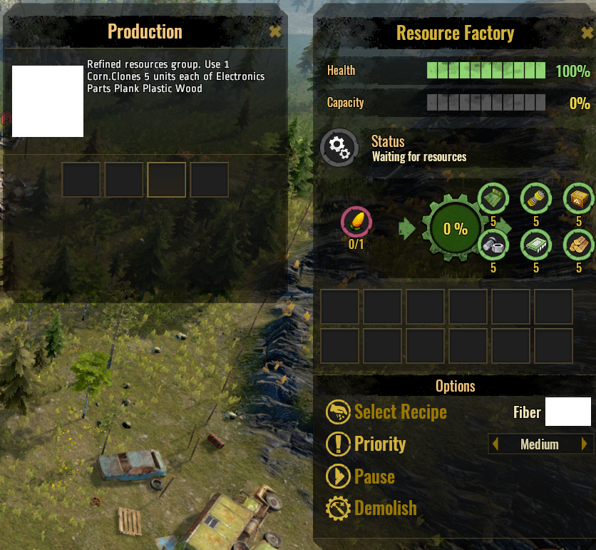
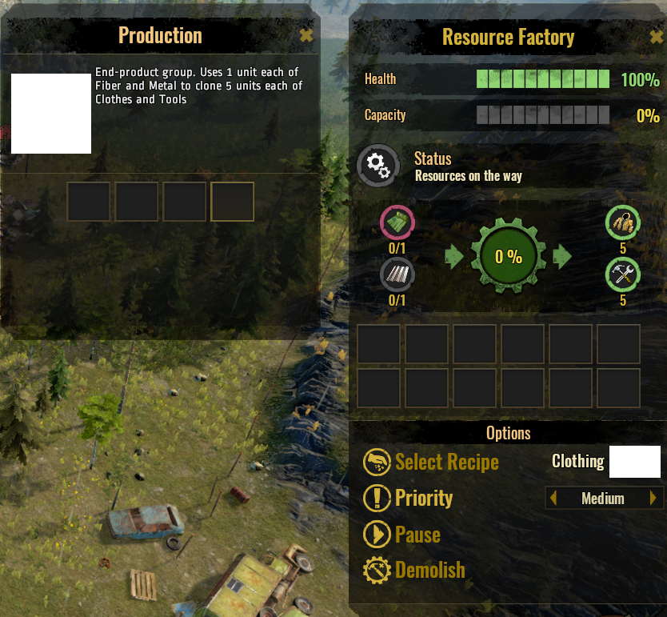

# STA-ResourceFactory

Creates a whole bunch of resources, using the Fish Factory mesh from the modtool sample (for now). Meant as a sandbox-enabler mod to test out game features, and counter the lack of resources in game.

## Design considerations

### Game design constraints

- The MODS user interface in the game has no scrollable panel to go to a second page, so we are limited to using 4 mods at a time (for now). Even if you placed more than 4 files in the Mods folder in Windows Explorer, only 4 would be visible.
- One mod to rule them all situation (for now). All the buildings will be overwritten by one mod upon the next load of the Save game. This appears to be a modtool design limitation, for the moment. Unless I missed a configuration somewhere.

### Mod design

- Located in Build menu under Resources tab.
- Removed the disaster-related features in the Fish Factory sample mod.
- Includes a Pause button to halt production as and when required. (v0.2)
- Churning out groups of resources takes 1 min (in-game time), when there's a worker available. (v0.3)
- Have built-in capacity storage for 550 units for the resources. (v0.3)

## Requirements

- ~~100 Science Points: need to build a General Storage first. Otherwise, produced items have no where to go and thus cannot be used.~~ Built-in storage provided. General Storage no longer required (v0.3)
- Construction Cost: Metal 2 units
- Repair cost: Metal 1 unit
- Demolished returns: Metal 2 units, Plastic 5 units
- Synthesize Medicine for producing Medicine group
- Catch Fish for producing Raw group
- Grow Corn for producing Refine Group
- Use Clothes and Tools for producing End Products group

## Expected outcome

- Output: see list below for each recipe group
- Select the recipe group for the products you wish to clone.

1. Recipe group: Medicine

    - Input: Medicine 1
    - Output: 2 each of Antibiotics, Iodine & Medicine

2. Recipe group: Raw building resources

    - Input: Fish 1
    - Output: 5 each of Concrete, Debris, Fiber, Firewood, Metal & Trash

3. Recipe group: Refined building resources

    - Input: Corn 1
    - Output: 5 each of Component, Electronics, Parts, Plank, Plastic & Wood

4. Recipe group: End products

    - Input: Fiber 1, Metal 1
    - Output: 5 each of Clothes & Tools

## Known issues

- UNITY-engine-related: Mods work only when enabled on NEW games (a Unity game design limitation)
- UNITY-engine-related: Cannot load a second Save game, have to QUIT to Desktop first. One mod-enablement per one load of the game.
- Mod-tool-related: Construction Cost has no icons
- Mod-tool-related: Recipe has no icons
- Mod-tool-related: haven't figured out a way to name recipes by "Select name" as per Cookhouse/Field buildings
- Non-flexible UI: same issue as the limit to 4 mods, the User Interface is not yet flexible, sizable or draggable

## Acknowledgements

- [Modtool project and paradoxwiki guide with Fish Factory sample](https://sta.paradoxwikis.com/Modding:_Basics)
- Tips of correcting the Description from reddit post by [@Gcrazygamer](https://www.reddit.com/user/Gcrazygamer/): [tip_for_modders_and_bug_for_xbox_mods](https://www.reddit.com/r/survivingtheaftermath/comments/dmq3kj/tip_for_modders_and_bug_for_xbox_mods/)

## Discussion

- for bug reports or questions, please post in [[mod] Ellacharmed's Resource Factory](https://forum.paradoxplaza.com/forum/index.php?threads/mod-ellacharmeds-resource-factory.1272140/) thread on the [Paradox Surviving The Aftermath forums](https://forum.paradoxplaza.com/forum/index.php?forums/surviving-the-aftermath.1060/)
