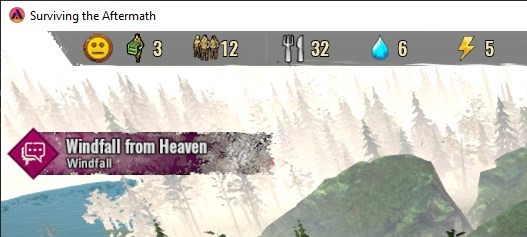

# STA-ResourceFactory

Creates a whole bunch of resources, using the Fish Factory mesh from the modtool sample (for now). Meant as a sandbox-enabler mod to test out game features and learn game mechanics, and counter the lack of resources in game.

## How to install

- Mod Subscription is not working via [paradoxplaza.com STA's Mod page](https://mods.paradoxplaza.com/games/surviving_aftermath). Use Manual method in guide linked below. As such, you can simply download the .mod file from the [release page](https://github.com/ellacharmed/STA-ResourceFactory/releases) of this repository, as well.
- Read the guide at my [ellacharmed.wordpress.com](https://ellacharmed.wordpress.com/2019/11/04/how-to-use-mods-in-surviving-the-aftermath/) blog page.

## Design considerations

### Why does this mod exist?

Well, due to some game-design constrains and bugs in the game, resources were an issue at the beginning of Early Access release back in October 2019. And since then, the subsequent patches have addressed some, but not all bugs, and also introduced a few more. So this mod initially is to ensure that my gameplay can proceed despite these constraints and bugs from one patch cycle to the next.

And then, my "pet-peeves" were shown not to be an isolated incident. And indeed, other players are complaining of the same issues, and so I uploaded it and release it to the public and here we are.

With the introduction of the Resource Extractors in one of the updates, I had thought that this mod is made redundant and have not updated it for months as I have been playing other games. But, as of patch version **1.12.4.8223 (Jan 2021)**, there's still some inherent bugs (the lockups aka stuck-running-bug still exists), and further balancing is still required despite all the improvements and enhancements of the past year. The production versus consumption values, that have been re-tweaked in this patch, still do not allow for the growth of the colony the way that suits our individualistic playstyle.

### Game design constraints

- ~~The MODS user interface in the game's Main Menu has no scrollable panel to go to a second page, so we are limited to using 4 mods at a time (for now). Even if you placed more than 4 files in the Mods folder in Windows Explorer, only 4 would be visible.~~
- ~~One mod to rule them all situation (for now). All the buildings will be overwritten by one mod upon the next load of the Save game. This appears to be a modtool design limitation, for the moment. Unless I missed a configuration somewhere.~~
- Developers introduced the soft-cap of 100 survivors, no matter the duration of the Save game. So this mod would alleviate the need for too many production buildings that require workers.

### Mod design

- Located in Build menu under Resources tab, as shown in introduction image above.
- With the tweaked Production and Consumption value of resources in patch version **1.12.4.8223 (Jan 2021)**,, I find that some resources simply cannot keep up with the demand in vanilla games. So, I've revamped all the Recipes and revert back to producing individual item types, except for the Pharmaceuticals, Tools, Clothing, Weapons and Food.
- Includes a Pause button to halt production as and when required. (patch 1.0)
- Added Production Limit. Use together with the Pause button so you don't overwhelmed your colony with transporting-resources-tasks when you don't have enough Carriers for other essential transporting tasks (like transporting Firewood).
- Currently made "**Automated**" like the upgraded Resource Extractors. Removed the worker slots. Encountered issue when assigning and unassigning workers - the ever-revolving no worker icon - even with enough free Carriers around. Have compared against Fish Factory which had no such issue, so need further study.
- Have built-in capacity storage for 500,000 units of resources. (patch 1.5)
- Removed the disaster-related features and the Energy requirement in the Fish Factory sample mod.
- Removed the use of Input values to clone basic resources under "Raw" group due to [issue #7](https://github.com/ellacharmed/STA-ResourceFactory/issues/7). Since resources shall not be consumed to clone more, I've reduced the output values so the Storage and Stockpile won't be overloaded.
- Since the Resource Factory is using the Fish Factory's mesh, the buildings have been differrentiated by placing a logo on the building's roof. (v0.3.6). I've also been updating the Fish Factory for every patch cycle. You can get it from the [StA-FishFactory release page](https://github.com/ellacharmed/StA-FishFactory/releases). 

## Requirements

- Construction Cost: 1 Plank, 1 Metal, 1 Plastic
- ~~Repair cost: Metal 2 units~~ Made Indestructible. Repair resources taken to building but turn red again with no repair done. Same issue with Fish Factory, so need further study.
- Demolished returns: Metal 2 units

## Expected outcome

- Output: recipe groups revamped for update 1.12.4 (Jan 2021)

 _Click image to play video via Youtube; video recorded while on Update 8_

## Known issues

- UNITY-engine-related: Mods work only when enabled on NEW games (a Unity game design limitation)
- UNITY-engine-related: Cannot load a second Save game in same gameplay session, have to QUIT to Desktop first. One time mod-enablement per one session load of the game.
- Mod-tool-related: input values (x) cancelling output (y) in recipes, even though x value is not equal to y value, when the using the same input & output resources. So x Concrete cannot create y Concrete. See [issue #7](https://github.com/ellacharmed/STA-ResourceFactory/issues/7)
- Non-flexible Building UI: icons can go off-screen from the Building UI's dialog box. The User Interface is not yet flexible, sizable or draggable.

 _UI overflow on both sides_  _UI overflow on right side_

## Acknowledgements

- The [Fish Factory sample mod](https://github.com/iceflake/survivingtheaftermath) by IceFlake Studios
- [Modtool project and paradoxwiki guide](https://sta.paradoxwikis.com/Modding:_Basics)
- Tips of correcting the Description from reddit post by [@Gcrazygamer](https://www.reddit.com/user/Gcrazygamer/): [tip_for_modders_and_bug_for_xbox_mods](https://www.reddit.com/r/survivingtheaftermath/comments/dmq3kj/tip_for_modders_and_bug_for_xbox_mods/)

## Discussion

- for bug reports or questions, please post in [[mod] Ellacharmed's Resource Factory](https://forum.paradoxplaza.com/forum/index.php?threads/mod-ellacharmeds-resource-factory.1272140/) thread on the [Paradox Surviving The Aftermath forums](https://forum.paradoxplaza.com/forum/index.php?forums/surviving-the-aftermath.1060/)

## Links

- Ella's version of the Fish Factory. Fixed some text in Localization and Events. Changed icon.
  - [download from github](https://github.com/ellacharmed/StA-FishFactory)

- Windfall mod

  - [download from github](https://github.com/ellacharmed/STA-Windfall)
  - [download from paradoxplaza](https://mods.paradoxplaza.com/mods/3571/Any)

- [How to install and use Mods in Surviving the Aftermath](https://ellacharmed.wordpress.com/2019/11/04/how-to-use-mods-in-surviving-the-aftermath/) guide via [ellacharmed](ellacharmed.wordpress.com)'s Wordpress blog
