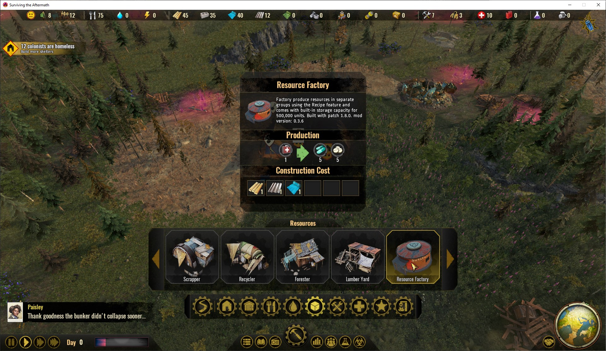
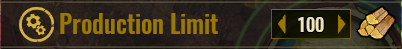
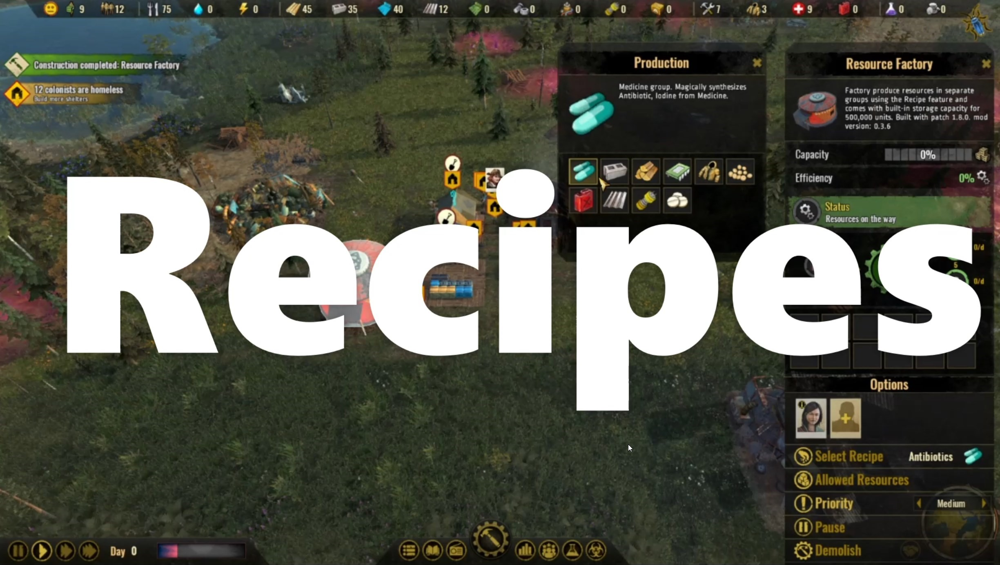

# STA-ResourceFactory

Creates a whole bunch of resources, using the Fish Factory mesh from the modtool sample (for now). Meant as a sandbox-enabler mod to test out game features and learn game mechanics, and counter the lack of resources in game. Plus, helps with the resource balancing of production chains.

## How to install

- If Mod Subscription does not work for you via [paradoxplaza.com STA's Mod page](https://mods.paradoxplaza.com/games/surviving_aftermath). Use '*Manual*' method in guide linked below. As such, you can simply download the .mod file from the [release page](https://github.com/ellacharmed/STA-ResourceFactory/releases) of this repository, as well.
- Read the full(er) guide at my [ellacharmed.wordpress.com](https://ellacharmed.wordpress.com/2019/11/04/how-to-use-mods-in-surviving-the-aftermath/) blog page.

## Design considerations

### Why does this mod exist?

Well, due to some game-design constrains and bugs in the game, resources were an issue at the beginning of Early Access release back in October 2019. And since then, the subsequent patches have addressed some, but not all bugs, and also introduced a few more. There were also some rebalancing needed in the resource production chain as developers add and remove stuff. So this mod initially is to ensure that my gameplay can proceed despite these constraints, bugs and changes from one patch cycle to the next.

And then, my '*pet-peeves*' were shown not to be an isolated incident. And indeed, other players are complaining of the same issues, and so I uploaded it and release it to the public and here we are.

With the introduction of the Resource Extractors in one of the updates, I had thought that this mod is made redundant and have not updated it for months as I have been playing other games. 

Despite all the improvements and enhancements of the past year, further balancing is still required. The production versus consumption values, that have been continously tweaked, the addition of Custom Game mode (in '*patch 1.22.0*') still do not allow for the growth of the colony the way that suits our individualistic playstyle.

### Game design constraints

- Due to the game design only allowing 1 function per building, built-in Storage has been removed from all factories. You need the in-game storage or the MegaStorage.
- This design constrain also means that I could not make each factory have a secondary function of providing
  - auto-scout colony map,
  - have power, or water, and/or heat.
- A newly found function of each production building requiring a specific '*profession*' means resources have to be split to separate buildings. Incidently, this is the root cause of the negative worker values upon unassigining/reassigning workers.

### Mod design

- Located in Build menu under Resources tab, as shown in banner image above. Food Factory is located under Food tab.

- Removed the Disaster-related & Event features ~~and the Energy requirement~~ in the Fish Factory sample mod.

- Basic & Food Factory available at Phase P2: after "Shoot the flare" step.

- All other Factories available at Phase P3: after Gate is built.

- The Recipes produce individual item types, except where base game's version also allow for multiple items - like Scrapper. Food Factory recipes produces both the ingredients to other recipes and meals.

-  Includes a Pause button to halt production as and when required. (patch 1.0)

-  Added Production Limit. Use together with the Pause button so you don't overwhelmed your colony with transporting-resources-tasks when you don't have enough Carriers for other essential transporting tasks (like transporting Firewood).

- ~~Currently made "**_Automated_**" like the upgraded Resource Extractors for Basic and Pharma~~.

- Currently "**_Indestructible_**", ie they won't take any Damage, as the Repair needs something else I have not figured out. Buildings will however get Polluted and need to be decontaminated.

- Are not disabled by Cold, ie works during Winter Storm.

#### **New in v1.22**

- Due to the limitation of the game that a building cannot be multi-functional, have added a new MegaStorage building in Storage menu, using the old roofless Stockpile mesh.

- 3 Worker slots for Mechanical and Manufacturing, all other factories have 2 worker slots.

- All factories except Basic require inputs. So that the stored items would be used and relieve the Storage capacity.

- With introduction of Game Modes in patch 1.22, have added Water and Energy buildings. So Custom Mode can be a true *sandbox* mode, especially when played with the [Debug Mode mod](#Debug_Mode_mod).

- Food Factory does not need water, unlike the Cookhouse/Mess Hall.

- Mechanical, Pharma and Manufacturing factories now have Low, Medium, High Energy requirements, respectively. Because I wanted to learn about modding these features.

- Since the Resource Factory mod is using the Fish Factory's mesh, the buildings have been differrentiated by different awning colours and placing resource logo icons on the building's signboard (from v0.3.6) and roof (from v1.22). 

I've also been updating the Fish Factory for every patch cycle. You can get it from the [StA-FishFactory release page](https://github.com/ellacharmed/StA-FishFactory/releases). 

## Requirements

- Construction Cost: 
  - Non-powered buildings: 6 Plank, 6 Plastic
  - Powered buildings: 6 Plank, 6 Plastic, 4 Metal
- ~~Repair cost: 5 Plastic~~ Made Indestructible. Repair resources taken to building but turn red again with no repair done. Same issue with Fish Factory, so need further study.
- Demolished returns: 5 Plastic

## Expected outcome

- Output: recipe groups revamped for update 1.12.4 (Jan 2021)

 _Click image to play video via Youtube; video recorded while on Update 8_

## Unity-engine / game-design limitations

1. Cannot use a newly downloaded mod in a pre-existing SAVE game. Must always start a NEW game.

1. Cannot load a game the SECOND time, even if you're about to start a NEW game. Once you have "Exit to Main Menu" once, you need to "Quit" the game all the way to the Desktop.

1. Remember that mods is still highly experimental if this is your first exposure to modding. Do not use mods if you do not like to restart a new game each time a mod is updated, or each time a game is updated that would render that mod obsolete for the newly release patch version.

1. Once a save game is "modded", that save cannot be reverted to a vanilla game forevermore. 

1. Once a mod is updated, that save with the older mod may no longer work; as the mod's signature is considered different by the game, thus why you'd need to start a NEW game.

## Known issues

- Mod-tool-related: input values (x) cancelling output (y) in recipes, even though x value is not equal to y value, when the using the same input & output resources. So x Concrete cannot create y Concrete. See [issue #7](https://github.com/ellacharmed/STA-ResourceFactory/issues/7)
- Non-flexible / non-responsive Building Infopanel UI: icons can go off-screen from the Building Infopanel UI's dialog box. The Infopanel User Interface is not yet flexible, sizable or draggable.

## Discussion/Bug reports

- for bug reports or questions, please post in the threads for the platforms you get mod from:

  - [[mod] Ellacharmed's Resource Factory](https://forum.paradoxplaza.com/forum/index.php?threads/mod-ellacharmeds-resource-factory.1272140/) thread on the [Paradox Surviving The Aftermath forums](https://forum.paradoxplaza.com/forum/index.php?forums/surviving-the-aftermath.1060/), or

  - [Steam Workshop mod thread](https://steamcommunity.com/sharedfiles/filedetails/?id=2472275697)

  - on [r/SurvivingtheAftermath subreddit](https://www.reddit.com/r/survivingtheaftermath/) Discord server's [#modding channel](https://discord.com/channels/637992051467616256/638530371272704050) (for more real-time interactions). But please do not DM, unless I ask for you to send files.

### Having issues with the mod?

- Verify that you have the mod enabled in the Select Mod screen in the game, not in Paradox Launcher
- Does the game crash when you load mods? Try disabling all other mods and running with just **this mod** _enabled_.
- Never do a SECOND load. Quit all the way to the Desktop.

### Troubleshooting

If you are sure that the cause is this mod, please provide **_ALL_** 6 (or 7) answers below. Incomplete answers would put you last in the queue while I answer others first, who have taken the time to help me help you, and provide all 6 (or 7) pieces of information.

1. Have you disabled all other mods except this one? `[YES/No]`
1. After you enabled just _this mod_, have you started a NEW game? `[YES/No]`
1. Is your game version same as the version stated in the Overview box? Please state your game version `[1.##.####]` in your report.
1. Is the issue you encountered still present? Can it be reproduced in the NEW game? `Please outline all the steps for me to reproduce at my end`, or send me the Save file.
1. If the issue is incompatibility with another mod (that is not mine), please `provide the URL` to the Workshop page (or elsewhere) so I may test.
1. Please post URL to the [pastebin](pastebin.com) of the logfile. Path to logfile: `%USERPROFILE%\AppData\LocalLow\Iceflake Studios\Surviving the Aftermath\`
1. (*optional*) Please post URL to the zipfile that contains the SAVE game and the logfile. Path to save game: `Documents\Paradox Interactive\Surviving the Aftermath\SaveGames`

*note: \[appdata\] is a hidden folder.* Need to toggle off the hide/show items in Options or on the View bar in Explorer

## Related Links

### Debug Mode mod

The game's built-in Cheat Menu enabled for regular gameplay. Normally only available during QA testing.

Download from

- [github](https://github.com/ellacharmed/StA-FishFactory)
- [Steam Workshop](https://steamcommunity.com/sharedfiles/filedetails/?id=2472277310)  

  

---

### Fish Factory mod

Ella's version of the Fish Factory.

- Added Recipes to input Meat type: Fish or Venison.
- Fixed some text in Localization and Events.
- Changed texture colours.
- Changed icon.

Download from

- [github](https://github.com/ellacharmed/StA-FishFactory)
- [Steam Workshop](https://steamcommunity.com/sharedfiles/filedetails/?id=2472277310)
  

---

### Windfall mod

Result of playing around with Events modding.

Download from

- [github](https://github.com/ellacharmed/STA-Windfall)
- [paradoxplaza](https://mods.paradoxplaza.com/mods/3571/Any)
- [Steam Workshop](https://steamcommunity.com/sharedfiles/filedetails/?id=2472277310)
   

---
### Install Guide

How to install and use Mods in Surviving the Aftermath guides via [ellacharmed's Blog](https://ellacharmed.wordpress.com) or Youtube

- [Wordpress post](https://ellacharmed.wordpress.com/2019/11/04/how-to-use-mods-in-surviving-the-aftermath/)
- [Video on Youtube](https://youtu.be/jYzMLDB_1YY)
    

## Acknowledgements

- The [Fish Factory sample mod](https://github.com/iceflake/survivingtheaftermath) by IceFlake Studios
- [Modtool project and paradoxwiki guide](https://sta.paradoxwikis.com/Modding:_Basics)
- Tips of correcting the Description from reddit post by [@Gcrazygamer](https://www.reddit.com/user/Gcrazygamer/): [tip_for_modders_and_bug_for_xbox_mods](https://www.reddit.com/r/survivingtheaftermath/comments/dmq3kj/tip_for_modders_and_bug_for_xbox_mods/)
- Models for well, barrel, wooden box from [Gigel's RPG Poly Pack - Lite](https://assetstore.unity.com/packages/3d/environments/landscapes/rpg-poly-pack-lite-148410) on the Unity Asset Store