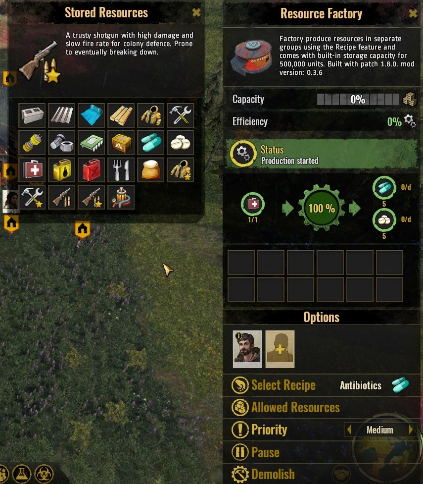

# STA-ResourceFactory

Creates a whole bunch of resources, using the Fish Factory mesh from the modtool sample (for now). Meant as a sandbox-enabler mod to test out game features, and counter the lack of resources in game.

## How to install

- Mod Subscription is not working via [paradoxplaza.com STA's Mod page](https://mods.paradoxplaza.com/games/surviving_aftermath). Use Manual method in guide linked below. As such, you can simply download the .mod file from the [release page](https://github.com/ellacharmed/STA-ResourceFactory/releases) of this repository, as well.
- Read the guide at my [ellacharmed.wordpress.com](https://ellacharmed.wordpress.com/2019/11/04/how-to-use-mods-in-surviving-the-aftermath/) blog page.

## Design considerations

Why does this mod exist?

Well, due to some game-design constrains and bugs in the game, resources were an issue at the beginning of Early Access release back in October of 2019. And since then, the subsequent patches have addressed some, but not all bugs and also introduced a few more. So this mod initially is to ensure that my gameplay can proceed despite these constraints and bugs from one patch cycle to the next.

And then my "pet-peeves" were shown not to be an isolated incident. And indeed, other players are complaining of the same issues, and so I uploaded it and release it to the public and here we are.

### Game design constraints

- ~~The MODS user interface in the game's Main Menu has no scrollable panel to go to a second page, so we are limited to using 4 mods at a time (for now). Even if you placed more than 4 files in the Mods folder in Windows Explorer, only 4 would be visible.~~
- ~~One mod to rule them all situation (for now). All the buildings will be overwritten by one mod upon the next load of the Save game. This appears to be a modtool design limitation, for the moment. Unless I missed a configuration somewhere.~~
- Developers introduced the soft-cap of 100 survivors, no matter the length of the Save game. So this mod would alleviate the need for too many production buildings.

### Mod design

- Located in Build menu under Resources tab.
- Includes a Pause button to halt production as and when required. (v0.2)
- Has 2 worker slots. Enable and disable as appropriate when you need faster production or when you need the workforce to be engaged elsewhere.
- Churning out groups of resources takes 1 min (in-game time), when there's a worker available. (v0.3.0)
- Have built-in capacity storage for 500,000 units for the resources. (v0.3.0) 
- Removed the disaster-related features and the Energy requirement in the Fish Factory sample mod. (v0.3.5)
- Removed the use of Input values to clone basic resources under "Raw" group due to [issue #7](https://github.com/ellacharmed/STA-ResourceFactory/issues/7). Since resources shall not be consumed to clone more, I've reduced the output values so the Storage and Stockpile won't be overloaded.
- Since the Resource Factory is using the Fish Factory's mesh, I've differrentiated them by placing a logo on the building's roof. (v0.3.6). I've also been updating the Fish Factory for every patch cycle, whenever I can. You can get it from the [StA-FishFactory release page](https://github.com/ellacharmed/StA-FishFactory/releases)  

## Requirements

- ~~100 Science Points: need to build a General Storage first. Otherwise, produced items have no where to go and thus cannot be used.~~ Built-in storage provided. General Storage no longer required (v0.3)
- Construction Cost: 1 Metal, 1 Plank, 1 Plastic
- Repair cost: Metal 2 units
- Demolished returns: Metal 2 units

## Expected outcome

- Output: see list below for each recipe group
- Select the recipe group for the products you wish to clone.

1. Recipe group: Medicine

   - Input: Medicine 1
   - Output: 1 Medicine synthesizes to 5 Antibiotics, 5 Iodine

1. Recipe group: Raw resources group

   - Input: None
   - Output: 5 each of Concrete, Fiber, Plastic, Plank, Scrap, Metal, Rare.

1. Recipe group: Refined-Now group.

   - Input: 1 each of Plastic, Plank, Metal and Scrap.
   - Output: 5 units each of Parts, and Firewood.

1. Recipe group: Refine-Later group.

   - Input: 1 Plastic, 1 Metal, 2 Parts, 2 Scrap and 2 Rare.
   - Output: 5 units each of Components, Electronics and Funbox.

1. Recipe group: End-product group.

   - Input: 1 unit each of Fiber, Metal and Scrap
   - Output: 5 units each of Clothes (Basic + Protective), Tools (Basic + Advanced), Weapons (Hunting Rifle + Shotgun).

1. Recipe group: Emergency food group.

   - Input: 2 Berries
   - Output: 75 units each of emergency food consisting Soybean, Wheat, Insect Meals and Mixed Meals.

1. Recipe group: Exploratory resource group.

   - Input: 5 Oil
   - Output: 10 Fuel

1. Recipe group: METAL only.

   - Input: None
   - Output: 10 Metal

1. Recipe group: COMPONENT only.

   - Input: 2 units each Parts and Rare
   - Output: 10 units of Components

1. Recipe group: IODINE only.

   - Input: 2 Medicine
   - Output: 10 Iodine

<!-- blank line -->
<figure class="video_container">
  <video controls="true" width="320" poster="Assets/Images/vid_poster_image.jpg">
    <source src="Assets/Images/Resources recipe groups.mp4" type="video/mp4">
  </video>
</figure>
<!-- blank line -->

<video width="320" height="240" controls>
  <source src="https://youtu.be/SMTmhD1iRSE" type="video/mp4">
</video>

## Known issues

- UNITY-engine-related: Mods work only when enabled on NEW games (a Unity game design limitation)
- UNITY-engine-related: Cannot load a second Save game in same gameplay session, have to QUIT to Desktop first. One time mod-enablement per one session load of the game.
- ~~Mod-tool-related: Construction Cost has no icons.~~
- ~~Mod-tool-related: Recipe has no icons.~~
- Mod-tool-related: haven't figured out a way to name recipes by "Select name" as per Cookhouse/Field buildings. It is currently showing name+icon of first resource in the recipe.
- Mod-tool-related: input values (x) cancelling output (y) in recipes, even though x value is not equal to y value, when the using the same input & output resources. So x Concrete cannot create y Concrete. See [issue #7](https://github.com/ellacharmed/STA-ResourceFactory/issues/7)
- Non-flexible Building UI: icons can go off-screen from the Building UI's dialog box. The User Interface is not yet flexible, sizable or draggable.

## Acknowledgements

- The [Fish Factory sample mod](https://github.com/iceflake/survivingtheaftermath)
- [Modtool project and paradoxwiki guide](https://sta.paradoxwikis.com/Modding:_Basics)
- Tips of correcting the Description from reddit post by [@Gcrazygamer](https://www.reddit.com/user/Gcrazygamer/): [tip_for_modders_and_bug_for_xbox_mods](https://www.reddit.com/r/survivingtheaftermath/comments/dmq3kj/tip_for_modders_and_bug_for_xbox_mods/)

## Discussion

- for bug reports or questions, please post in [[mod] Ellacharmed's Resource Factory](https://forum.paradoxplaza.com/forum/index.php?threads/mod-ellacharmeds-resource-factory.1272140/) thread on the [Paradox Surviving The Aftermath forums](https://forum.paradoxplaza.com/forum/index.php?forums/surviving-the-aftermath.1060/)

## Links

- Ella's version of the Fish Factory. Fixed some text in Localization and Events. Changed icon.
  - https://github.com/ellacharmed/StA-FishFactory
- Windfall mod
  - https://github.com/ellacharmed/STA-Windfall
  - https://mods.paradoxplaza.com/mods/3571/Any
- [How to install and use Mods in Surviving the Aftermath](https://ellacharmed.wordpress.com/2019/11/04/how-to-use-mods-in-surviving-the-aftermath/) guide via [ellacharmed](ellacharmed.wordpress.com)'s Wordpress blog
